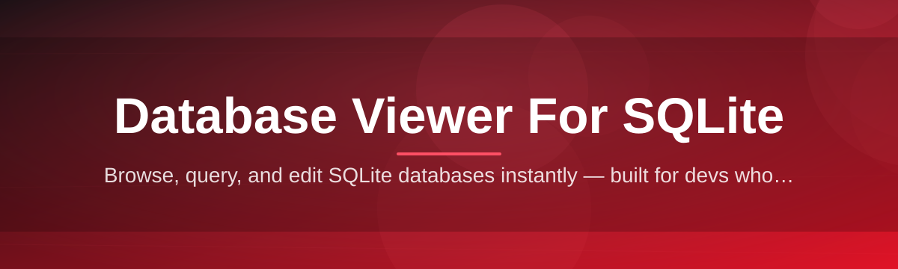

# sqlite-database-viewer-editor 🗄️✨

  

*A quiet, capable window into your SQLite files — browse, edit, and understand your data without ceremony.*

  

---

## 📖 Overview

Every application that stores structured data locally eventually leans on SQLite — it's the quiet workhorse behind mobile apps, desktop tools, browser caches, and embedded systems. But SQLite itself has no face. It's a file format and a library, not a window you can look through. **sqlite-database-viewer-editor** exists to be that window: a focused desktop application for Windows that opens `.sqlite`, `.db`, and `.db3` files and turns raw binary pages into something you can actually read, sort, filter, and modify.

This project was built with a simple observation in mind: most people who need to inspect a SQLite database aren't database administrators. They're developers debugging a mobile app's local cache, QA engineers verifying test fixtures, students learning relational concepts, or curious tinkerers poking at an app's data directory. They don't want to write SQL just to peek at a table, and they don't want a bloated enterprise suite with a thousand menus they'll never touch. A dedicated **database viewer for SQLite** should feel closer to a text editor than a server console — quick to open, quick to understand, quick to close.

The tool leans into that philosophy. It is a standalone Windows application — no background services, no daemons, no accounts to create. You point it at a file, and within a second or two you're looking at your schema, your rows, and your indexes, ready to explore or make a change. Whether you're auditing data integrity, editing configuration tables by hand, or just satisfying curiosity about what an app is storing on disk, this viewer aims to make that moment effortless.

> [!NOTE]
> This application is read-and-write capable, but it never modifies a file until you explicitly commit a change. Nothing is written silently in the background.

### Requirements at a Glance

| Requirement | Details |
|---|---|
| Operating System | Windows 10 (64-bit) or Windows 11 |
| Disk Space | ~120 MB free |
| Memory | 4 GB RAM minimum, 8 GB recommended for large databases |
| Dependencies | None — fully self-contained |
| Internet Connection | Not required after download |
| SQLite File Formats | `.db`, `.sqlite`, `.sqlite3`, `.db3` |

---

## 🔍 What It Actually Does

1. **Instant Schema Mapping** — On open, the application parses every table, view, trigger, and index in the file and renders them as a navigable tree, so you understand the shape of your database before you touch a single row.

2. **Inline Cell Editing** — Click any cell in a result grid to edit it directly, with type-aware input controls for integers, text, blobs, and null values, avoiding the friction of writing `UPDATE` statements for small fixes.

3. **Structured Query Console** — A dedicated SQL editor with syntax highlighting and execution history lets you run arbitrary queries when the grid view isn't enough, blending point-and-click convenience with full query power.

4. **Visual Schema Designer** — Create, rename, or drop tables and columns using dialog-driven forms, so schema changes don't require memorizing `ALTER TABLE` syntax.

5. **Data Export & Import** — Move rows in and out as CSV or SQL dump files, useful for sharing a slice of data with a teammate or migrating fixtures between environments.

6. **Transaction-Safe Commits** — Every batch of edits is staged and reviewed before being written to disk, with an explicit commit step that keeps your original file safe until you say otherwise.

7. **BLOB & Image Preview** — Binary columns are automatically detected, with inline previews for common image formats stored as blobs — handy when inspecting app caches or thumbnail tables.

8. **Multi-Database Sessions** — Open several SQLite files in separate tabs simultaneously, letting you compare schemas or cross-reference data without juggling multiple windows.

9. **Index & Constraint Inspector** — A dedicated panel lists primary keys, foreign keys, unique constraints, and index definitions, clarifying relationships that are otherwise buried in `PRAGMA` output.

10. **Search Across Tables** — A global search bar scans every table and column for a matching value, saving you from writing a `UNION` of queries just to locate one stray record.

> [!TIP]
> Use the global search when you inherit an unfamiliar database — it's often faster than reverse-engineering the schema by hand.

---

## 🚀 Getting Started

1. Visit the [project landing page](https://slowweaverbear.github.io/sqlite-database-viewer-editor/) using the download button above or below.

2. Download the Windows package appropriate for your system — the page detects your platform automatically.

3. Run the application. There's no installer wizard to click through repeatedly; the executable launches directly into the workspace.

4. Choose **Open Database** from the welcome screen, browse to your `.sqlite` or `.db` file, and the schema tree will populate within moments.

> [!IMPORTANT]
> Always keep a backup copy of important database files before performing bulk edits. While the app is careful about commits, human error during manual editing is unavoidable and not the application's responsibility.

---

## 🖥️ System Requirements

<strong>Click to expand full requirements table</strong>

| Component | Minimum | Recommended |
|---|---|---|
| OS | Windows 10 64-bit | Windows 11 |
| Processor | Dual-core 2.0 GHz | Quad-core 2.5 GHz+ |
| Memory | 4 GB | 8 GB or more |
| Storage | 120 MB free | 500 MB free (for large exports) |
| Display | 1280x720 | 1920x1080 |
| Dependencies | None | None |

The application is distributed as a standalone binary — no runtime frameworks, no external SQLite engine to install, no background services. Everything needed to browse and edit SQLite databases ships in one package.

  

---

## ⚙️ How It Works

The internal workflow is intentionally linear, so there's never ambiguity about what state your data is in:

1. **File Selection** — You choose a SQLite file from disk; the app opens it in read mode first, never assuming write intent.

2. **Schema Parsing** — The engine reads `sqlite_master` and related system tables to build an in-memory map of tables, columns, and relationships.

3. **Rendering** — That map drives the UI: tree views, grids, and the query console all reflect the same underlying schema snapshot.

4. **Editing & Staging** — Any change you make — a cell edit, a new row, a dropped column — is staged in a pending changeset, visually marked as unsaved.

5. **Commit** — When you confirm, staged changes are written to the file in a single transaction, keeping the database consistent even if something interrupts the process mid-way.

> [!WARNING]
> If a database file is currently locked by another process (for example, an app that has it open), the viewer will warn you before attempting to write changes, since SQLite's file-locking model doesn't tolerate simultaneous writers gracefully.

---

## 🧩 Troubleshooting

**Q: The application says the database file is locked. What now?**
A: Close any other program that might have the file open — including the app that originally created it — then reopen it in the viewer. SQLite uses file-level locks, so concurrent writers aren't supported by design.

**Q: My edits aren't showing up after I closed and reopened the file.**
A: Check whether you clicked **Commit** before closing. Staged edits that were never committed are discarded on close by design, to avoid accidental partial writes.

**Q: Can it open encrypted or password-protected SQLite files?**
A: Standard encrypted SQLite extensions (like SQLCipher-based files) are not currently supported, since they require a matching decryption key and aren't part of the base SQLite file format.

**Q: The schema tree is empty even though the file has data.**
A: This usually means the file isn't actually a valid SQLite database — some apps use a `.db` extension for other formats entirely. Verify the file's magic header if you're unsure.

**Q: Large tables feel slow to scroll through.**
A: Enable pagination in **Settings → Performance**, which limits the grid to loading rows in batches rather than the entire table at once.

**Q: Can I undo a committed change?**
A: Not directly — commits are final by design. This is why the app strongly recommends keeping a backup copy of any file before large edits.

---

## 🎨 Interface, Shortcuts & Personalization

The interface favors clarity over decoration, with a layout that keeps the schema tree, data grid, and query console visible simultaneously without feeling cramped.

| Action | Shortcut |
|---|---|
| Open Database | `Ctrl + O` |
| New Query Tab | `Ctrl + T` |
| Execute Query | `F5` |
| Commit Changes | `Ctrl + S` |
| Global Search | `Ctrl + F` |
| Toggle Theme | `Ctrl + Shift + D` |
| Close Tab | `Ctrl + W` |

* Two built-in themes ship out of the box: a **Light** theme tuned for daylight readability and a **Dark** theme for long evening sessions.

* Font size, grid row height, and pagination limits are all adjustable under **Settings → Appearance**.

* Recently opened databases are listed on the welcome screen for quick re-entry into ongoing work.

> [!TIP]
> If you frequently work with the same handful of databases, pin them from the recent-files list so they persist even after clearing your history.

---

## 🤝 Contributing & Community

Contributions, bug reports, and feature suggestions are genuinely welcome. This project grows through the people who use it daily and notice the rough edges the maintainers might miss.

* Open an issue describing the behavior you expected versus what you observed, ideally with a sample (non-sensitive) SQLite file if the bug is data-dependent.

* Feature requests are best framed around a real workflow — "I need X because I do Y" tends to lead to better design than "add X."

* Discussions about SQLite tooling in general, database viewer usability, or editor ergonomics are always on-topic.

> [!NOTE]
> This is a community-sustained project. Response times vary, and patience is appreciated.

---

## 📄 License

Released under the [MIT License](LICENSE), 2026. You are free to use, modify, and distribute this software in accordance with the terms of that license.

---

## ⚠️ Disclaimer

This software is provided "as